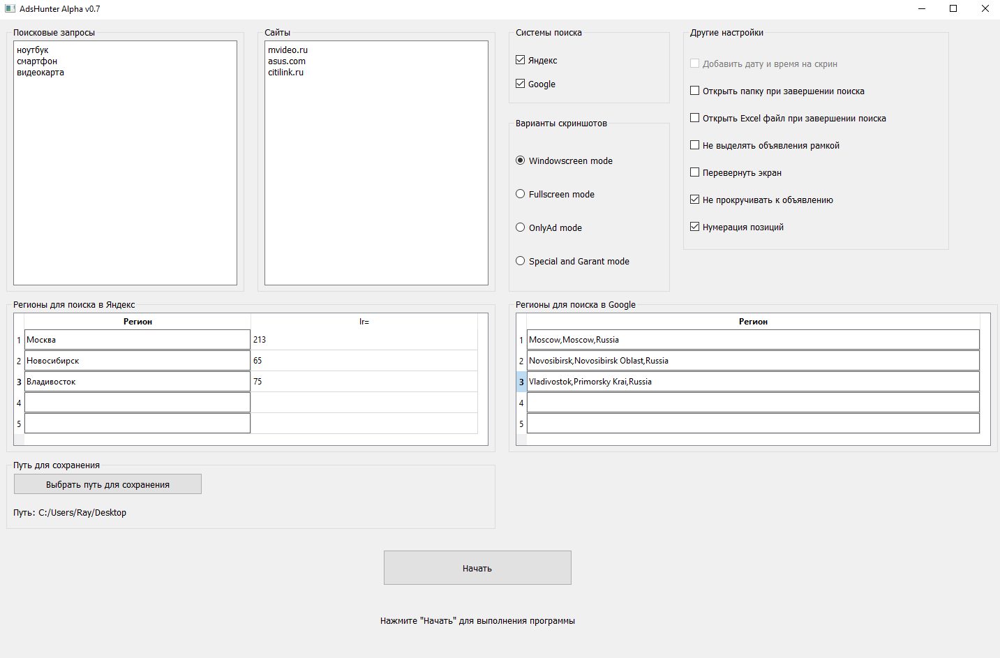
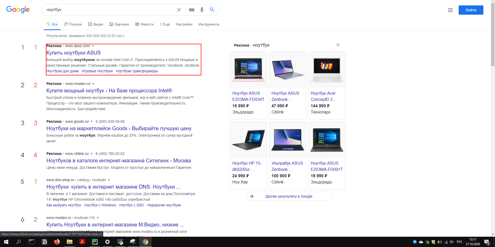
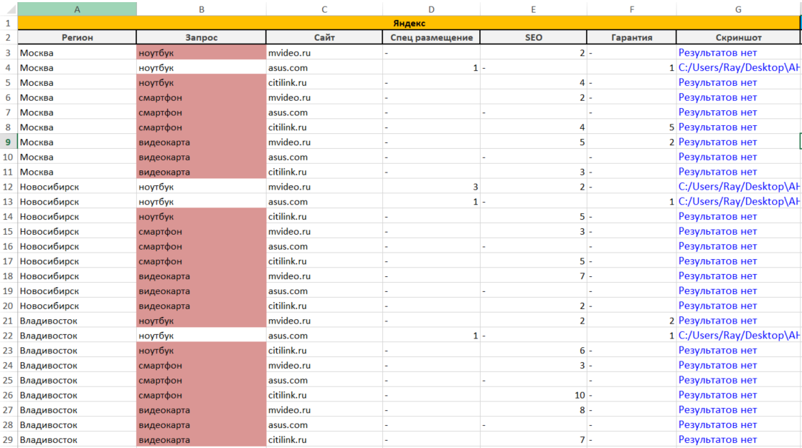

# AdsHunter
Программа разработана для автоматизации аудита.

Если вы хотите узнать показывается ли ваше объявление в системах поиска Яндекса или Google,
но для того чтобы не перебирать запросы вручную разработана эта программа.

## Пример работы

Интерфейс программы.

Результат.

Файл со статистикой.

## Запуск
* Скачать проект

* Установить необходимые пакеты командой `pip install -r requirements.txt`

* Запустить командой `python main.py`

